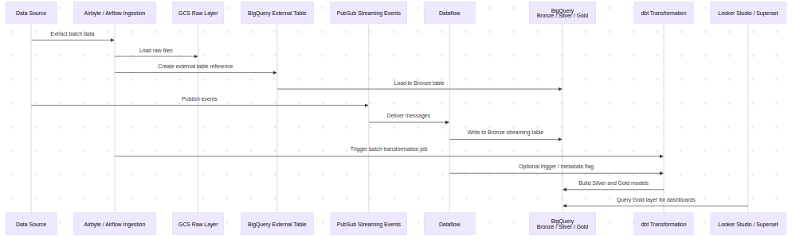

---
## Summary
- Design a **temporary analytics solution** to deliver fast and actionable business insights while the complete data infrastructure is still under construction
- Prioritize **speed of deployment** over architectural perfection to address urgent analytics needs from business teams
- Implement **data ingestion using Data Fusion**, allowing low-code pipelines to rapidly integrate batch and streaming sources
- Store and analyze data in **BigQuery**, leveraging its scalability, SQL support, and integration with visualization tools
- Provide **business dashboards via Looker Studio**, enabling teams to interact with live data through an intuitive interface

### Key Terms for Understanding the Overall System

<details - open>  
<summary>Plain-language explanations of technologies and components used in this solution</summary>

---

- **Data Fusion**
  - A Google Cloud tool that helps connect and move data from many sources using a simple drag-and-drop interface  
  - Allows building data pipelines **without much coding**  

- **Pub/Sub**  
  - A service for receiving real-time data (e.g. from websites, apps, or IoT devices)  
  - Works like a messaging system: some sources **publish** data, and others **subscribe** to process it  

- **Dataflow**  
  - A service that processes and transforms data, especially streaming data  
  - Ensures the right format and structure before storing in the data warehouse  

- **BigQuery**  
  - A fully-managed cloud database used for analyzing large datasets using SQL  
  - Stores both temporary and long-term business data  

- **GCS (Google Cloud Storage)**  
  - A place to store **raw files**, like CSVs or JSON, similar to Google Drive but for systems  

- **Looker Studio**  
  - A web-based tool for creating **interactive dashboards** from BigQuery and other sources  
  - Business users can view charts, KPIs, and trends without needing to write SQL  

- **Dashboard**  
  - A visual report with charts and tables that summarize key business information  
  - Helps teams make decisions based on current data  

---

</details>

---

## System Architecture

### Data Sources
<details - open>  
<summary>Overview of batch and streaming data origins</summary>

---

- **Batch sources** such as exported CSV files from internal tools, CRM systems, or external vendors.
- **Streaming sources** like real-time application logs, user activity data, or IoT device events.


---

</details>

### Ingestion Layer
<details - open>  
<summary>Batch and streaming pipelines using Data Fusion and Pub/Sub</summary>

---


#### Batch Ingestion – via Data Fusion
- Google Cloud **Data Fusion** is used to create visual ETL pipelines that ingest batch files from various sources.
- These files are stored temporarily or long-term in **Google Cloud Storage (GCS)**.
- Data Fusion handles format conversions, schema mapping, and basic cleaning.
---

#### Streaming Ingestion – via Pub/Sub + Dataflow
- Streaming data (e.g. app events) is pushed into **Google Cloud Pub/Sub**.
- A **Dataflow** pipeline subscribes to these topics and processes data in real-time.
- Data is cleaned, parsed, and loaded directly into **BigQuery** or staged via GCS.
---
</details>

### Storage and Analytics Layer
<details - open>  
<summary>BigQuery as the central warehouse for batch and streaming</summary>

---

- The core data warehouse is **BigQuery**, where both batch and streaming data converge.

#### For batch data:
- GCS is mounted as an **external table** in BigQuery.
- This allows querying without duplicating storage and supports schema changes easily.

---
#### For streaming data:
- Dataflow loads data directly into BigQuery managed tables with append-only strategy.

---

</details>

### Visualization Layer
<details - open>  
<summary>Dashboards in Looker Studio using live BigQuery data</summary>

---

- **Looker Studio** connects directly to BigQuery to build interactive dashboards.
- Business users can filter views, track KPIs, monitor trends, and create custom charts without needing SQL knowledge.
- Dashboards are updated in near-real-time depending on streaming latency and refresh policies.

---

</details>

### Flexibility & Change Accommodation
<details - open>  
<summary>System flexibility and long-term integration potential</summary>

---

- Using **external tables** from GCS ensures flexibility in case schemas evolve.
- **Looker dashboards** are easy to reconfigure, enabling business teams to adjust to changing needs quickly.
- The whole system is modular, so each component (ingestion, storage, visualization) can be replaced or upgraded individually.

---

</details>

---

## Planning 
---


### Development Phases  
<details - open>  
<summary>Two-week plan to implement a rapid analytics system</summary>  

---  

#### Week 1: Foundation for Ingestion and Storage  

---

##### Day 1–2: Batch Pipeline Setup  

- Configure **GCS bucket structure**: `/raw/`, `/archive/`, `/error/`  
- Design and deploy **Data Fusion pipelines** to ingest static CSVs into GCS  
- Auto-create **external tables** in BigQuery from staged files  
- Use built-in schema detection and perform light data cleaning in visual pipelines  

---

##### Day 3: Real-Time Streaming Pipeline  

- Create **Pub/Sub topics** simulating live events (user actions, transactions)  
- Build **Dataflow pipeline** to:  
  - Subscribe to Pub/Sub  
  - Transform records (JSON → flattened schema)  
  - Write into **BigQuery managed tables**  
- Implement basic logging and dead-letter topics for invalid messages  

---

##### Day 4–5: Storage Modeling in BigQuery  

- Define layered model in BigQuery:
  - `staging` (external tables)
  - `cleaned` (partitioned, clustered)
  - `business_mart` (derived KPIs, dimensions, facts)
- Apply **naming conventions**, **partitioning strategy**, and **clustered columns**  
- Write reusable SQL views for core metrics  

---

#### Week 2: Dashboard & Production Readiness  

---

##### Day 6–7: Dashboard Setup with Looker Studio  

- Connect BigQuery to **Looker Studio**  
- Build initial dashboards:
  - Top-line KPIs
  - Real-time vs historical trend views
  - Drill-downs by time, location, category  
- Add filters and drop-down controls for exploration  

---

##### Day 8–9: Backfill Historical Data + Alerts  

- Load historical files into batch pipelines  
- Re-run pipelines to populate cleaned tables  
- Add **scheduled queries** or **alerts** for data freshness, missing data  

---

##### Day 10: Final Testing + Handover  

- Run end-to-end validation (GCS → BigQuery → Dashboard)  
- Prepare **handover documentation** for the next team (architecture, data dictionary)  
- Gather feedback from business team and iterate  

---

</details>


---

## Dashboard Implementation Plan

---

### Dashboard Design and Rollout Strategy
<details - open>
<summary>Plan to design, build, and maintain business-friendly dashboards for rapid analytics</summary>
---

- **Goals and Business Needs**
  - Deliver dashboards that offer **fast insights** from batch and streaming data sources
  - Empower business teams to **explore data independently** without technical support
  - Support decision-making with **visualizations of up-to-date data**

---

#### Dashboard Tool: Looker Studio
- Looker Studio is chosen for its **seamless integration** with BigQuery
- Allows business users to build, share, and interact with live dashboards
- Enables real-time visualization of:
  - App installs and user engagement trends
  - Campaign performance by region or channel
  - Funnel drop-off and session duration metrics

---

#### Data Connections
- Dashboards are powered by **direct queries to BigQuery**
- Support both:
  - **External tables** (for batch files in GCS)
  - **Managed tables** (for streaming data from Pub/Sub → Dataflow → BigQuery)
- Enables **live updating** of dashboard visuals as new data arrives

---

#### Design Principles
- Follow **consistent visual templates** with branded themes
- Use **filters** (date range, campaign, region) for interactivity
- Group KPIs using tabs or sections:
  - Acquisition
  - Engagement
  - Retention
- Use conditional formatting to highlight anomalies or threshold breaches

---

#### Access and Sharing
- Dashboards are published with **access control** based on business team roles
- Links are embedded in internal portals or emailed as snapshots
- Data source permissions are managed via **BigQuery IAM policies**

---

#### Performance and Maintenance
- Apply **data extracts** or scheduled refreshes for heavy queries
- Limit visual complexity to improve load time
- Assign owners for each dashboard to maintain logic and documentation
- Use consistent naming: `dashboard_<team>_<purpose>` and version tracking

---
</details>

---

## Basic setup and configuration guide 

### Project & Environment Setup (GCP UI Method)

<details - open>
<summary>Configure GCP project and services via GCP Console</summary>

---

#### Step 1: Create or select a GCP project

- Go to https://console.cloud.google.com/projectselector2/home/dashboard
- Click **New Project** or select an existing project to use for this pipeline.

---

#### Step 2: Set up project-level configurations

- Open the **Project Settings**
- Set your preferred **Region** (e.g., `asia-southeast1`) under Compute/Resources

---

#### Step 3: Enable required APIs

- Navigate to **APIs & Services > Library**
- Enable the following services:
  - **Cloud Data Fusion API**
  - **BigQuery API**
  - **Pub/Sub API**
  - **Dataflow API**
  - **Cloud Storage API**
  - **Looker Studio API**

---

#### Step 4: Create service account for pipeline jobs

- Go to **IAM & Admin > Service Accounts**
- Click **Create Service Account**
  - Name: `analytics-ingestor`
  - Description: `Service account for data pipelines`
- Click **Create and Continue**
- Assign the following roles:
  - **BigQuery Data Editor**
  - **Pub/Sub Editor**
  - **Dataflow Developer**
  - **Storage Admin**
- Click **Done**

---

#### Step 5: Set up local environment (optional for CLI users)

- If you're working locally and want to test or deploy via CLI:
  - Download and install [Google Cloud SDK](https://cloud.google.com/sdk/docs/install)
  - Run `gcloud auth login` to authenticate
  - Use Python virtual environment for scripting (if applicable)

---

</details>

### Data Batch Ingestion Setup

<details - open>
<summary>Batch Data Ingestion Setup (CSV/JSON via Data Fusion)</summary>

---

- Goal: Rapidly ingest batch files (CSV or JSON) from GCS into BigQuery using Cloud Data Fusion's low-code interface

---

#### Create a Cloud Storage Bucket for Batch Files

- Go to **GCS → Create Bucket**
- Name: `batch-data-bucket`
- Region: same as your BigQuery/Data Fusion deployment
- Default storage class: `Standard`
- Click **Create**

---

#### Create a BigQuery Dataset and Table (optional if using auto-create)

- Navigate to **BigQuery → Create Dataset**
- Dataset ID: `batch_dataset`
- Location: same region as GCS bucket
- Click **Create Dataset**
- You may let Data Fusion auto-create the table schema from CSV header, or predefine the table manually for more control

---

#### Enable Data Fusion API and Create an Instance

- Visit **Data Fusion → Enable API** if it's not yet enabled
- Click **Create Instance**
- Name: `quick-batch-fusion`
- Region: same as GCS/BQ
- Tier: **Basic** (low-cost for rapid setup)
- Click **Create** (provisioning takes ~10–15 minutes)

---

#### Design Batch Pipeline via Drag-and-Drop Interface

- Go to **Instances → quick-batch-fusion → View Instance**
- Open **Pipeline Studio**
- Click **+ Create Pipeline → Batch Pipeline**

**Add the following nodes:**
- **GCS File** (source)
  - File path: `gs://batch-data-bucket/<your_file>.csv`
  - Format: `CSV` or `JSON`
- **Wrangler** (optional): preview, clean, and transform schema
- **BigQuery Table** (sink)
  - Dataset: `batch_dataset`
  - Table name: `target_table`
  - Schema: either auto-detected or manually defined

---

#### Deploy and Execute Pipeline

- Click **Validate Pipeline** to check for errors
- Click **Deploy**
- Click **Run** to start ingestion

---

#### Expected Outcome

- Your CSV/JSON data will be loaded into the specified BigQuery table.
- You can immediately query the data in BigQuery or visualize it using Looker Studio.

---

</details>

### Data Streaming Ingestion Setup

<details - open>
<summary>Streaming Ingestion Setup (Real-Time Events via Pub/Sub & Dataflow)</summary>

---

- Goal: Ingest real-time data (e.g., JSON events) using **Pub/Sub → Dataflow → BigQuery**
- Architecture prioritizes quick setup, low code, and scalability

---

#### Step 1: Create a Pub/Sub Topic

- Go to **Pub/Sub → Topics → Create Topic**
- Name: `streaming-events-topic`
- Retention: default (7 days)
- Click **Create**

```bash
# Optional: create using gcloud
gcloud pubsub topics create streaming-events-topic
```

---

#### Step 2: Create a BigQuery Dataset and Table

- Go to **BigQuery → Create Dataset**
  - Dataset ID: `streaming_dataset`
  - Location: same as Dataflow job
- Click **Create Dataset**

- Create a table that matches the schema of your streaming messages (e.g., JSON)

```sql
CREATE TABLE streaming_dataset.realtime_events (
  event_id STRING,
  event_type STRING,
  event_timestamp TIMESTAMP,
  payload JSON
);
```

---

#### Step 3: Launch a Dataflow Streaming Job Using Template

- Go to **Dataflow → Create Job from Template**
- Template: `Pub/Sub to BigQuery`
- Job name: `streaming-job`
- Region: same as Pub/Sub and BigQuery
- Parameters:
  - **Input Pub/Sub topic:** `projects/YOUR_PROJECT_ID/topics/streaming-events-topic`
  - **Output BigQuery table:** `YOUR_PROJECT_ID:streaming_dataset.realtime_events`
  - **Use template schema auto-detection:** Yes (or provide schema if known)
  - Enable `autoCreateTables=true` if table does not exist

```bash
# Optional gcloud alternative
gcloud dataflow jobs run streaming-job \
  --gcs-location gs://dataflow-templates/latest/Stream_GCS_to_BigQuery \
  --region asia-southeast1 \
  --parameters \
      inputTopic=projects/YOUR_PROJECT_ID/topics/streaming-events-topic,\
      outputTableSpec=YOUR_PROJECT_ID:streaming_dataset.realtime_events,\
      autoCreateTables=true
```

---

#### Step 4: Simulate or Push Test Messages to Pub/Sub

```bash
gcloud pubsub topics publish streaming-events-topic \
  --message '{"event_id":"abc123", "event_type":"click", "event_timestamp":"2025-06-18T10:00:00Z", "payload":{"url":"https://example.com"}}'
```

- Can be done programmatically via backend, IoT devices, or external systems

---

#### Step 5: Verify Real-Time Data in BigQuery

- Navigate to **BigQuery → streaming_dataset → realtime_events**
- Use preview or run SQL queries to confirm data is arriving
- Example:

```sql
SELECT * FROM streaming_dataset.realtime_events
ORDER BY event_timestamp DESC
LIMIT 10;
```

---

</details>

### Looker Studio Setup
<details - open>
<summary>Configure Looker Studio to visualize data from BigQuery</summary>

---

- **Purpose**: Create interactive dashboards from both batch and streaming data stored in BigQuery.

#### Prerequisites
- Ensure batch and streaming pipelines have written data to **BigQuery native tables**.
- Confirm `BigQuery` dataset permissions allow access from `Looker Studio`.
- Use **partitioned tables** or **materialized views** for efficient querying in Looker.

---

#### Steps to Connect BigQuery to Looker Studio

- Go to [Looker Studio](https://lookerstudio.google.com/) and click **“Blank Report”**.
- Click **Add Data** → Choose **BigQuery**.
- Authenticate using your Google account and select the correct project.
- Navigate to your dataset and select:
  - Batch: the native table created via CTAS or ingestion.
  - Streaming: the partitioned table populated by Dataflow or Pub/Sub.
- Click **Add** → The table is now available in Looker Studio as a data source.

---

#### Access and Sharing

- Set viewer credentials to **“Viewer’s credentials”** or **“Owner’s credentials”** depending on security.
- Share dashboard with team members via link or embed in Confluence/Notion.

---
</details>

### Data Modeling Strategy: Bronze, Silver, Gold Layers
<details - open>
<summary>Multi-layered transformation plan after batch & streaming ingestion</summary>

---

#### Bronze Layer – Raw Ingested Data

- **Objective**: Persist raw data as-is from ingestion sources for traceability and reprocessing.
- **Batch**:
  - Data is ingested via **Data Fusion** into **Google Cloud Storage (GCS)**.
  - External tables are created in **BigQuery** referencing GCS paths.
- **Streaming**:
  - Real-time messages flow from **Pub/Sub → Dataflow**, which loads data into **BigQuery native tables**.
  - Tables should be **partitioned by ingestion timestamp** and optionally clustered by identifiers.

- **Tools**:
  - **Data Fusion** (for batch ingestion)
  - **Dataflow + Pub/Sub** (for streaming ingestion)
  - **BigQuery External Tables** (batch)
  - **BigQuery Native Tables** (streaming)

- **Schema Strategy**:
  - Use flexible schemas, e.g., `JSON` columns, to preserve raw structure.
  - Minimal transformation or parsing—preserve fidelity of original data.

---

#### Silver Layer – Cleaned and Structured Data

- **Objective**: Apply initial transformation logic: parsing, type casting, validation, enrichment, and de-duplication.
- **Batch**:
  - Use **CTAS (Create Table As Select)** to convert external to native tables.
  - Apply cleaning logic using **BigQuery SQL**, or optionally **Spark** (Dataproc) for large-scale joins.
- **Streaming**:
  - Use **scheduled queries** or **materialized views** for continuous transformation.
  - Ensure partitioning and clustering for optimal performance.

- **Transformations**:
  - Parse nested JSON into flat schema.
  - Type cast fields (e.g., `timestamp`, `int64`).
  - Join with static reference data (e.g., region codes, user profiles).
  - De-duplicate using `ROW_NUMBER()` or `ARRAY_AGG()`.

- **Tools**:
  - **BigQuery SQL** (primary engine for transformation)
  - **Trino** (ad hoc query engine if warehouse agnostic)
  - **Apache Spark** (for complex data shaping if needed)

---

#### Gold Layer – Business-Facing Aggregated Data

- **Objective**: Provide analytics-ready, curated datasets for reporting and dashboards.
- **Batch**:
  - Use **modular SQL** or **DBT** to define reporting tables.
  - Schedule refresh using **BigQuery scheduled queries** or **DBT Cloud/CLI**.
- **Streaming**:
  - Use **materialized views** or insert into **pre-aggregated native tables**.
  - Optimize for latency and performance (e.g., precompute metrics).

- **Transformations**:
  - Define KPIs and business metrics (e.g., revenue per region).
  - Build star schema: `fact_` and `dim_` tables.
  - Apply business logic: status mappings, thresholds, and rolling windows.

- **Tools**:
  - **DBT** for version-controlled modeling.
  - **BigQuery** for transformation and storage.
  - **Looker Studio** or **Looker** for dashboarding.
  - Optional orchestration: **Cloud Composer**, **Airflow**, or **Dataform**.

---
</details>

---

## Migration Planning
<details open>
<summary>Refactor pipeline from temporary setup (A06) to production-grade architecture</summary>

---

### Why the A06 Architecture is Only Temporary

| Component               | Current (A06 - Temporary)                                              | Issues                                                                 |
|-------------------------|------------------------------------------------------------------------|------------------------------------------------------------------------|
| **Batch Ingestion**     | Cloud Data Fusion → GCS → BQ External Table → CTAS                    | ❌ Hard to test, no version ,lacks orchestration, hard to customize
| **Streaming Ingestion** | Pub/Sub → Dataflow → BigQuery Native Table                            | ⚠️ Usable but lacks schema validation, alerting, DLQ                  |
| **Transformations**     | CTAS SQL scripts manually executed in BigQuery                        | ❌ Lacks lineage, reusability, modularity, and CI/CD                  |
| **Data Warehouse**      | BigQuery with ad-hoc CTAS                                              | ❌ No schema validation, testing, or structure                         |
| **Visualization**       | Looker Studio connected directly to BQ tables                         | ⚠️ No semantic layer, hard to manage KPIs or access control          |
| **Monitoring & Governance** | None                                                              | ❌ No alerts, tests, or documentation                                  |

---

### Migration Targets for Production-Ready Architecture

| Component               | Plan to Upgrade To                                                    | Justification                                                                 |
|-------------------------|------------------------------------------------------------------------|--------------------------------------------------------------------------------|
| **Batch Ingestion**     | Airflow (Composer) or Airbyte                                         | ✅ Full control of versioning, scheduling, lineage, easier testing            |
| **Streaming Ingestion** | Pub/Sub → Dataflow (keep) + Schema Registry, DLQ, Monitoring Layer    | ✅ Adds schema validation, error handling, and alerting for production use     |
| **Transformations**     | DBT DAGs (Bronze → Silver → Gold)                                     | ✅ Modular, testable, version-controlled SQL with CI/CD                       |
| **Data Warehouse**      | BigQuery (native tables via DBT)                                      | ✅ Keep BQ for performance + integrate with DBT for modeling and validation   |
| **Visualization**       | Looker with LookML (or keep Looker Studio short-term)                 | ✅ Adds semantic layer, controlled access, reusable metrics                   |
| **Monitoring & Governance** | DBT Docs, Airflow Alerts, BQ Job Monitoring                      | ✅ Ensures observability, better debugging, and lineage tracking              |

---

### Sequence Diagram : 



### Flow Diagram : 


### Summary of Improvements

- **Modular architecture**: Use DBT to separate layers and track dependencies
- **Versioning and CI/CD**: Manage pipelines in Git with tests and automatic deployment
- **Testability and validation**: Built-in schema tests, uniqueness checks, null constraints in DBT
- **Monitoring**: Add alerts and monitoring to identify data pipeline failures early
- **Production readiness**: Build pipelines with resilience, logging, and scalability in mind

---
</details>


## Conclusion

---

With this plan, we are able to implement a **temporary analytics pipeline** that:

- Supports business needs while the company’s full data platform is still under development  
- Enables Data Analysts to explore and deliver insights within just **1–2 weeks**  
- Provides visibility into key metrics through dashboards and live data pipelines  

This approach ensures that important data-driven decisions are not delayed, and that teams can begin working with real data immediately—even before the final infrastructure is ready.

---
