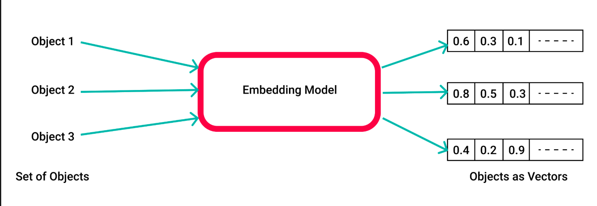
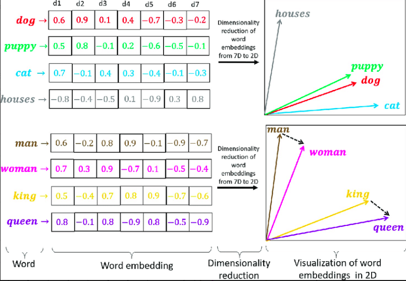
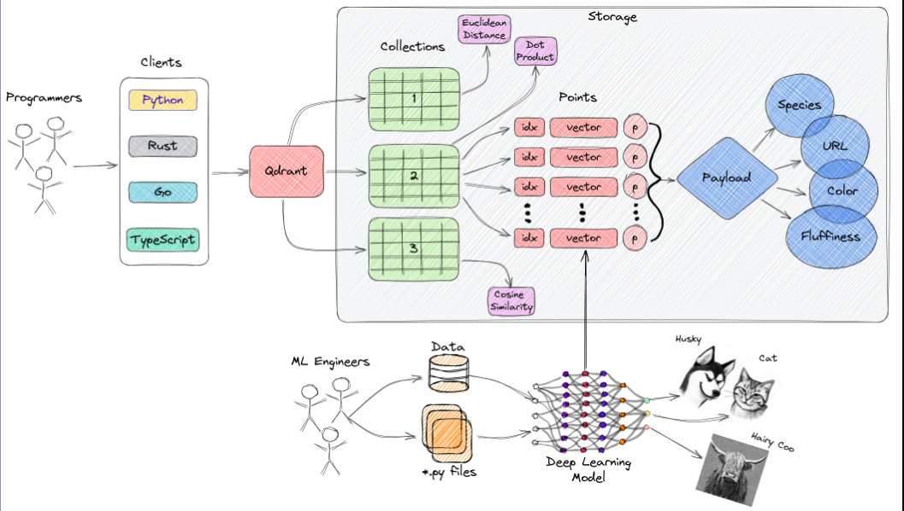

---
## Overview

---

### Task Purpose and Goals

<details - open>  
<summary>Purpose and goals of the B01 Vector Database Tutorial task</summary>  

---

- This report is developed as part of **Task B01 - Vector Database Tutorial**.
- The main goal is to create a clear, practical, and self-contained guide to **vector database technologies**.
- The report is intended for both **self-study** and **team knowledge sharing**, making the content accessible across technical and non-technical roles.
- The tutorial supports cross-functional understanding, targeting data engineers, analysts, and product teams.

#### Report Objectives

- Introduce **key concepts**, **definitions**, and **real-world use cases** of vector databases.
- Compare major tools in the current **vector database ecosystem**.
- Conduct a **deep dive** into one selected tool with architectural and implementation insights.
- Provide **practical implementation guidance** using hands-on examples.
- Summarize **best practices** for performance tuning, scalability, and deployment.

#### Style and Approach

- Written in a **simple, direct, and plain language** style.
- Content includes **diagrams**, **code samples**, and **GenAI prompt workflows** where applicable.
- The final product is designed to serve as both:
  - A **learning resource** for individuals, and
  - A **reference document** for onboarding and collaboration within teams.

---
</details>


## Terminology

- Before diving into Vector Databases, it is important to understand several related concepts that surround and support them.

### Vector

<details - open>  
<summary>A vector is a numerical representation of data in high-dimensional space</summary>  

---

- A **vector** is a list of numerical values, usually floats, representing an object (e.g., sentence, image, audio) in a multi-dimensional space.  
- Vectors are the core representation used in **semantic similarity**, enabling comparison between unstructured data.  
- The **distance** or **angle** between vectors determines how similar the data objects are.  
- Vector databases operate by storing and searching for these high-dimensional vectors.

---
</details>

### Embedding
<details - open>  
<summary>A vector is a numerical representation of unstructured information (such as text, images, audio) in a high-dimensional space </summary>  

- **Embedding** is the process of converting raw data (e.g., text, image, audio) into numerical vectors.  
- It allows machines to **capture the semantic meaning** of the input using pre-trained or fine-tuned machine learning models.  
- For example, the sentences “I like tea” and “I enjoy hot drinks” will have similar embeddings, reflecting their semantic similarity.  
- If we want to **understand relationships between images, text, or audio**, we must first **digitize** these data types into a common format — embedding enables this transformation.  
- Embeddings are essential for tasks such as **semantic search**, **recommendation systems**, **multi-modal AI**, and **retrieval-augmented generation (RAG)**.




---
</details>

### Vector Embedding

<details - open>  
<summary>Vector embedding is the process of encoding unstructured data into numerical vectors</summary>  

---

- **Vector embedding** combines the idea of “vector” and “embedding” — it refers to the **resulting vector** produced after embedding data.  
- It is the actual **numerical representation** of unstructured data like text, image, or audio.  
- These vectors are used in **semantic search**, **similarity matching**, and **machine learning models**.  
- Vector embeddings preserve the **semantic structure** of the input data in a way that machines can compute on.  
- Example: "dog" and "puppy" will have vector embeddings that are close together in vector space.



---
</details>

### ANN (Approximate Nearest Neighbor)

<details - open>  
<summary>ANN enables fast similarity search by approximating the closest vectors</summary>  

---

- **ANN** is an algorithmic approach for finding vectors that are **similar** (nearest) to a given input vector.  
- It **trades accuracy for speed**, allowing scalable search across millions or billions of vectors.  
- Used extensively in recommendation engines, similarity search, and retrieval systems.  
- Common algorithms: **HNSW**, **IVF**, **LSH**, **ScaNN**.  
- Unlike brute-force exact search, ANN narrows the search space using index structures.

---
</details>

---

### Payload

<details - open>  
<summary>Payload is the metadata attached to a vector for filtering or enrichment</summary>  

---

- A **payload** is structured or unstructured metadata stored alongside a vector.  
- Examples: `{ "title": "Cat", "tags": ["animal", "pet"], "created_at": "2024-01-01" }`  
- Payloads help apply **filters**, support **hybrid search**, and provide contextual information.  
- They are not part of the vector itself but **extend the search capabilities**.  
- Payloads enable combining **semantic** (vector) and **symbolic** (metadata) filters.

---
</details>

---

### Indexing

<details - open>  
<summary>Indexing structures vectors to make search faster and more efficient</summary>  

---

- **Indexing** is the process of organizing vectors to optimize query performance.  
- Without indexing, searching would require scanning all vectors (**brute-force**).  
- Index types vary depending on speed vs. accuracy trade-offs (e.g., **Flat**, **HNSW**, **IVF**).  
- A good index improves **latency**, **memory usage**, and **accuracy** of results.  
- Some databases support **dynamic indexing** for real-time insertions and updates.

---
</details>

---

### RAG (Retrieval-Augmented Generation)

<details - open>  
<summary>RAG combines retrieval and generation to produce context-aware answers</summary>  

---

- **RAG** is an architecture that integrates **vector search** (retrieval) with **LLMs** (generation).  
- A vector DB retrieves relevant documents based on the query embedding.  
- The retrieved context is then fed into a **language model** to generate accurate, grounded responses.  
- RAG helps overcome LLM limitations like hallucination and outdated knowledge.  
- Used in **AI assistants**, **enterprise Q&A bots**, and **document-based search systems**.

---
</details>

---

### Collection

<details - open>  
<summary>A collection is a logical group of vectors and their payloads</summary>  

---

- A **collection** is the top-level container in a vector database.  
- Similar to a table in SQL or an index in Elasticsearch.  
- Each collection contains:
  - A unique schema,
  - A set of vectors,
  - Their associated payloads,
  - Indexing strategy and metadata.  
- Collections allow for **namespace isolation**, **query scope restriction**, and **versioned datasets**.

---
</details>


---

## Introduction to Vector Databases

---
### Concept Overview and Motivation

<details - open>  
<summary>Definition, motivation, and use cases of vector databases</summary>  

---

- A **Vector Database** is a specialized system designed to store, manage, and search high-dimensional vectors.  
- These vectors typically represent **unstructured data** such as text, images, video, or audio, which are encoded via **embedding models**.  
- Traditional databases are not optimized for **similarity search** based on vector distances (e.g., cosine similarity, Euclidean distance).  
- Vector databases enable **semantic search** — retrieving data that is *contextually similar*, not just textually identical.  
- They are optimized for **Approximate Nearest Neighbor (ANN)** algorithms, supporting fast and scalable vector retrieval.

#### Why Vector Databases Matter

- Explosion of unstructured data requires new ways to represent and query information.
- Embeddings provide a way to compare meaning, not exact matches.
- Vector DBs power intelligent applications like:
  - **Search engines** (semantic, multi-modal)
  - **Recommendation systems**
  - **Chatbots and AI assistants** (via Retrieval-Augmented Generation)
  - **Image/audio recognition**

#### Core Characteristics

- Store billions of vectors efficiently with fast indexing.
- Support hybrid filtering using metadata (payloads).
- Integrate with AI/ML workflows and embedding pipelines.
- Scale horizontally and offer high throughput for real-time applications.

#### Real-World Example
- Instead of matching exact keywords, vector DBs compare the *meaning* of your query:  
  - Input question: **"How to cook beef pho?"**  
    - → is embedded as a vector: `[0.12, 0.45, 0.89, ...]`  
  - System finds documents with similar vectors, like:
    - “Traditional Pho Recipe at Home”
    - “Tips for Rich Pho Broth”  
  - It ignores unrelated content like:
    - “How to Make Pizza”  
- This enables much **smarter, intent-based retrieval** than keyword matching.

#### Popular Vector Database Tools

- A growing ecosystem of open-source and commercial tools exists to support vector-based search:
  - **Qdrant**
  - **Pinecone**
  - **Weaviate**
  - **Milvus**
  - **FAISS** (by Meta)
  - **ElasticSearch** (with vector support)
- These tools differ in indexing strategies, scalability, hybrid search capabilities, and ecosystem integration.

---
</details>

## Comparison of Popular Vector Database Tools

---

### Overview of Tools

<details - open>  
<summary>Overview of major open-source and managed vector database tools</summary>  

---

- **Qdrant**  
  - Open-source, written in Rust for high performance  
  - Offers REST/gRPC APIs, vector + payload filtering  
  - Optimized for hybrid search (vector + metadata)  
  - Easy Docker deployment; supports HNSW indexing  
  - Good documentation and active development community  

- **Pinecone**  
  - Fully managed vector DB as a service  
  - No self-hosting; ideal for fast prototyping and scaling  
  - Advanced indexing behind the scenes, abstracted from user  
  - Pricing-based tiers; good for teams with cloud-native needs  
  - Tight integration with OpenAI, LangChain, Cohere, etc.  

- **Weaviate**  
  - Open-source, GraphQL-native API with strong semantic tooling  
  - Integrated text vectorizers (Transformers, OpenAI)  
  - Supports hybrid search and schema definition  
  - Modular storage backends (in-memory, disk, cloud)  
  - Built-in support for classification, nearText queries  

- **Milvus**  
  - High-performance, cloud-native, open-source system  
  - Optimized for billion-scale vector search  
  - Supports multiple indexes (IVF, HNSW, Flat, etc.)  
  - Backed by Zilliz; supports distributed deployments  
  - Popular choice for production-grade AI applications  

- **FAISS (Facebook AI Similarity Search)**  
  - Library (not a database) focused on similarity search  
  - Extremely fast, GPU-accelerated search  
  - Best for embedding search in custom pipelines  
  - No persistence layer or API – needs developer integration  
  - Commonly used to build custom in-memory vector search  

- **ElasticSearch (Vector support)**  
  - Widely-used full-text search engine with vector capabilities  
  - Suitable for hybrid text + vector search  
  - Supports k-NN plugin for vector fields  
  - Large ecosystem and scalable infrastructure  
  - Not optimized for ANN; slower than specialized tools  

---
</details>

### Feature Comparison Table

<details - open>  
<summary>Compare vector tools by core features and capabilities</summary>  

---

| **Feature**              | **Qdrant** | **Pinecone** | **Weaviate** | **Milvus** | **FAISS** | **ElasticSearch** |
|--------------------------|------------|--------------|--------------|------------|-----------|-------------------|
| Open Source              | ✅         | ❌           | ✅           | ✅         | ✅        | ✅                |
| Managed Hosting          | ❌         | ✅           | ❌           | ❌         | ❌        | ✅ (self-manage)   |
| ANN Indexing             | ✅ (HNSW)   | ✅ (auto)     | ✅           | ✅         | ✅        | ✅ (plugin)        |
| Metadata Filtering       | ✅         | ✅           | ✅           | ✅         | ❌        | ✅                |
| API Support              | REST/gRPC  | REST         | GraphQL/REST | REST       | ❌        | REST              |
| Built-in Embedding       | ❌         | ❌           | ✅           | ❌         | ❌        | ❌                |
| Scalability              | High       | High         | Medium       | High       | High      | High              |
| Best Use Case            | Hybrid search | Quick deploy | Semantic APIs | Large-scale AI | Custom pipelines | Hybrid + keyword |

---
</details>

### Use Case Recommendation

<details - open>  
<summary>Which vector database to use depending on the project context</summary>  

---

| **Use Case**                             | **Recommended Tool(s)**               | **Reason**                                           |
|------------------------------------------|----------------------------------------|------------------------------------------------------|
| **Fast prototyping / low setup overhead** | Pinecone                              | Fully managed, no infra needed                      |
| **Hybrid search (text + vector)**         | Qdrant, Weaviate, ElasticSearch        | Native support for metadata + vector filtering      |
| **On-premise deployment**                 | Qdrant, Milvus, Weaviate, FAISS        | All open-source with self-hosting options           |
| **Massive-scale vector search**           | Milvus, FAISS                          | Designed for billion+ vector scale                  |
| **GPU-accelerated custom workflows**      | FAISS                                  | Best-in-class performance with GPU support          |
| **Semantic search with built-in models**  | Weaviate                               | Integrated vectorizers like BERT, OpenAI            |
| **RAG pipelines with OpenAI**             | Pinecone, Qdrant                       | Easy integration with LangChain, OpenAI, Cohere     |
| **Enterprise search over documents**      | ElasticSearch                          | Text-first with strong ecosystem and vector plugin  |

---
</details>

--- 

## Deep Dive on Qdrant

### Architecture & Components
<details - open>  
<summary></summary>

---

- Qdrant is a powerful, flexible, and easy-to-deploy vector search engine designed for modern AI applications.  
- As unstructured data like text, images, and audio becomes central to intelligent systems, vector search has emerged as a key technology — and Qdrant offers a production-ready solution to enable it.



#### Collections  
- A **collection** is a named set of points (vectors with optional payloads).  
- Each collection uses:
  - A fixed **distance metric** (Cosine, Euclidean, or Dot Product)  
  - A defined **vector dimensionality**  
- **Named vectors**: You can store multiple vectors per point, each with different names and settings.

- **Core CRUD operations via HTTP API**:
  - **Create collection**:
    ```http
    PUT /collections/my_collection
    Content-Type: application/json

    {
      "vectors": {
        "size": 300,
        "distance": "Cosine"
      }
    }
    ```
  - **Update a Collection**  
    - Enable features like **on-disk vector storage** for better memory efficiency  
    - Useful for large-scale, resource-constrained deployments  
    - Example:
      ```json
      PATCH /collections/my_collection
      {
        "vectors": {
          "": {
            "on_disk": true
          }
        }
      }
      ```
  - **Get collection info**:
    ```http
    GET /collections/my_collection
    ```
  - **Delete collection**:
    ```http
    DELETE /collections/my_collection
    ```

- Qdrant also supports **updating collection parameters**, although major settings (like vector size) are immutable.

#### Distance Metrics  
- Used to measure vector similarity. Must be selected during collection creation.  
- Options include `Cosine`, `Euclidean`, and `Dot Product`.  
- The choice depends on how vectors were created (i.e., embedding model or encoder type).

---

#### Points  
- The central entity in Qdrant, consisting of:
  - `id`: a unique identifier
  - `vector`: a high-dimensional representation of raw data
  - `payload`: additional metadata in JSON format

---

#### Vector  
- A numerical representation of raw content like **images**, **audio**, **documents**, or **videos**.  
- Vectors are used for similarity comparison in high-dimensional space.

---

#### Payload  
- A **JSON object** that stores associated metadata (e.g., category, tags, URL).  
- Useful for **hybrid search** where filtering conditions apply alongside vector similarity.

---

#### Storage  
- Qdrant supports two storage options:
  - **In-memory**: Stores vectors entirely in RAM for fastest access.
  - **Memmap**: Uses memory-mapped files for lower memory usage and large-scale storage.

---

#### Clients  
- Qdrant can be used via multiple programming languages:  
  - `Python`, `Rust`, `Go`, `TypeScript`  
- APIs include both **REST** and **gRPC**, making integration flexible.


#### Filtering  
- Filtering allows refining vector search using **structured metadata** attached to each point (`payload`).  
- It is a key feature of **hybrid search**, where filtering conditions are combined with vector similarity.  
- Filters are defined using **JSON DSL (Domain-Specific Language)**.

- Qdrant supports the following filter operations:

  - **Match**: Exact match of a value
    - Example: `"color" == "red"`

  - **Match Any**: Field matches any value from a list
    - Example: `"category" in ["tech", "finance"]`

  - **Match Except**: Exclude certain values
    - Example: `"author" != "anonymous"`

  - **Nested Key**: Query inside nested JSON structures
    - Example: `"address.city" == "New York"`

  - **Nested Object Filter**: Apply filter rules inside a nested object block
    - Useful for complex schemas

  - **Full Text Match**: Case-insensitive partial text matching (like SQL `LIKE`)
    - Useful for fuzzy keyword matching

  - **Range**: Query numeric values within a range
    - Example: `"score" > 0.5`

  - **Datetime Range**: Filter by timestamp range
    - Example: `"created_at" between 2023-01-01 and 2023-06-30"`

  - **UUID Match**: Use for exact UUID equality comparison

  - **Geo**: Filter by geolocation using lat/lon + radius
    - Example: `within 50km of (10.762622, 106.660172)`

  - **Values Count**: Match based on number of values in an array field

  - **Is Empty / Is Not Empty**: Check if a field exists or is empty

  - **Is Null / Is Not Null**: Detect missing values

  - **Has ID**: Filter points by ID value(s)

  - **Has Vector**: Filter only points that contain vectors

- These filters can be combined using `must`, `should`, `must_not` logic similar to Elasticsearch.


---

</details>

### Core Concepts Refresher
<details - open>  
<summary></summary>

---

#### Vector Similarity Search  
- Vector similarity search is the **core operation** in vector databases.  
- Instead of keyword matching, it retrieves items that are **mathematically close** in vector space.  
- Uses distance metrics (e.g., **cosine similarity**, **Euclidean**, **dot product**) to rank similarity between query and stored vectors.  
- Useful in:
  - **Semantic search**
  - **Recommendation systems**
  - **Image/audio similarity**
- Example:
  - A user searches for: _“Best beaches in Asia”_
  - The system compares the embedded query vector with all stored document vectors and ranks the closest ones.

---

#### Approximate Nearest Neighbor (ANN)  
- ANN refers to a class of algorithms that retrieve **similar vectors quickly** without scanning the entire dataset.  
- Vector databases use ANN to achieve **sub-second latency** even with **millions of vectors**.  
- Qdrant uses the **HNSW (Hierarchical Navigable Small World)** algorithm as its default ANN implementation.

- **HNSW in Qdrant**:
  - Organizes vectors into **layers of proximity graphs**:
    - Higher layers have fewer nodes (coarse connections for fast skipping)
    - Lower layers are denser (fine-grained search)
  - Traversal starts from the top layer and descends until the **closest approximate neighbors** are found.
  - Balances **search accuracy vs. performance** using parameters:
    - `ef_construction`: Controls graph quality at indexing time
    - `m`: Controls the number of connections per node
    - `ef`: Controls the breadth of search during querying
  - Users can tune these parameters when creating or updating a collection.

- **Why Qdrant chose HNSW**:
  - High **recall-to-latency** ratio
  - Supports **dynamic updates** (adding/deleting points without full rebuild)
  - Efficient in both memory and CPU usage

- This makes HNSW suitable for real-time applications like:
  - **Semantic search**
  - **Image similarity**
  - **Chatbot retrieval**

---

</details>

## Deployment and Setup

### Deployment Options
<details - open>  
<summary>Available methods to deploy Qdrant locally or in production</summary>

---

- **Docker (Recommended for quick start)**
  - Easiest way to get Qdrant up and running in seconds
  - Example:
    ```bash
    docker run -p 6333:6333 qdrant/qdrant
    ```

- **Precompiled Binaries**
  - Download directly from [GitHub Releases](https://github.com/qdrant/qdrant/releases)
  - Suitable for manual setup on Linux-based systems

- **Qdrant Cloud**
  - Hosted option managed by the Qdrant team
  - Requires registration at [cloud.qdrant.io](https://cloud.qdrant.io)
  - Best for production with built-in scaling and snapshots

- **Kubernetes**
  - For high-availability production workloads
  - Helm charts available for managing deployment across nodes

---

</details>

### Docker  

<details - open>  
<summary>Run Qdrant with Docker for local testing and development</summary>  

---

- The easiest way to start using Qdrant for **testing or development** is to run the Qdrant container image.
- The latest versions are always available on **DockerHub**.
- Make sure that **Docker**, **Podman**, or the container runtime of your choice is installed and running.
- The following instructions use Docker.

- **Pull the image**
  ```bash
  docker pull qdrant/qdrant
  ```

- In the following command, revise `$(pwd)/path/to/data` for your Docker configuration. Then use the updated command to run the container:
  ```bash
  docker run -p 6333:6333 \
    -v $(pwd)/path/to/data:/qdrant/storage \
    qdrant/qdrant
  ```

  - With this command, you start a Qdrant instance with the default configuration.
  - It stores all data in the `./path/to/data` directory.
  - By default, Qdrant uses port `6333`, so at `localhost:6333` you should see the welcome message.

- **To change the Qdrant configuration, you can overwrite the production configuration**
  ```bash
  docker run -p 6333:6333 \
    -v $(pwd)/path/to/data:/qdrant/storage \
    -v $(pwd)/path/to/custom_config.yaml:/qdrant/config/production.yaml \
    qdrant/qdrant
  ```

- **Alternatively, you can use your own `custom_config.yaml` configuration file**
  ```bash
  docker run -p 6333:6333 \
    -v $(pwd)/path/to/data:/qdrant/storage \
    -v $(pwd)/path/to/custom_config.yaml:/qdrant/config/custom_config.yaml \
    qdrant/qdrant \
    ./qdrant --config-path config/custom_config.yaml
  ```

---
</details>

### Docker Compose  

<details - open>  
<summary>Run Qdrant using Docker Compose for simplified local orchestration</summary>  

---

- Docker Compose allows you to **define and manage multi-container applications** using a simple YAML file.
- This is useful for **testing and development** setups that require port configuration, volume mounting, and auto-restart.

- Example `docker-compose.yml` file for a single-node Qdrant setup:
  ```yaml
  version: '3.8'

  services:
    qdrant:
      image: qdrant/qdrant:latest
      container_name: qdrant
      restart: always
      ports:
        - "6333:6333"
        - "6334:6334"
      expose:
        - "6333"
        - "6334"
        - "6335"
      volumes:
        - ./qdrant_data:/qdrant/storage
      configs:
        - source: qdrant_config
          target: /qdrant/config/production.yaml

  configs:
    qdrant_config:
      content: |
        log_level: INFO
  ```

  - Once the file is ready, you can run Qdrant with:

  ```bash
  docker compose up -d
  ```

  - This will launch Qdrant at http://localhost:6333, with persistent storage in the ./qdrant_data directory and default logging level set to INFO.

- **Note:**
  - The `configs` block requires Docker Compose v2.23.1+ and Docker Engine v25.0.0+.
  - You can adjust the `log_level` and other configuration fields as needed.
  - Data will be stored persistently in the `./qdrant_data` directory.
  - You can scale up this setup by expanding the Compose file for **multi-node deployment**, load balancing, and backups.

---

</details>

### Python SDK  
<details - open>  
<summary>Use Qdrant's official Python client to interact with the database programmatically</summary>  

---

- Qdrant provides an official Python SDK to make it easy to:
  - Create and manage collections
  - Upload and query vectors
  - Apply filtering, payloads, and metadata
  - Run similarity and ANN searches

- **Installation**
  ```bash
  pip install qdrant-client
  ```

- The SDK simplifies integration with Python-based apps such as:
  - AI/ML pipelines (e.g., embedding pipelines)
  - Retrieval-Augmented Generation (RAG)
  - Vector-based recommendation systems
  - Backend services using FastAPI, Flask, or Django

---
</details>


## Implementation Guidance – Practical Usage Examples

### Example: Semantic Search with Qdrant and Sentence Transformers
<details - open>  
<summary></summary>

---


---

</details>

## Best Practices – Optimization and Performance

---


## Demo Code 

### Recommendation system (Spotify ELT Project) 

---

## References

---

- [Top 10 Open Source Vector Databases – Instaclustr](https://www.instaclustr.com/education/vector-database/top-10-open-source-vector-databases/)
- [Tổng quan Search Engine và Vector Database (Viblo)](https://viblo.asia/p/tong-quan-search-engine-va-vector-database-part-1-n1j4lRAlLwl)
- [Pinecone – Learn about Vector Embeddings](https://www.pinecone.io/learn/vector-embeddings/)
- [Langchain Docs – Qdrant Vectorstore Integration](https://python.langchain.com/docs/integrations/vectorstores/qdrant/)
- [Qdrant – Giải pháp Vector Search hiệu quả cho AI và ứng dụng (LinkedIn)](https://www.linkedin.com/pulse/qdrant-gi%E1%BA%A3i-ph%C3%A1p-vector-search-hi%E1%BB%87u-qu%E1%BA%A3-cho-ai-v%C3%A0-%E1%BB%A9ng-%C4%91%E1%BA%B7ng-xu%C3%A2n-xlvic/)
- [Qdrant Documentation – Overview](https://qdrant.tech/documentation/overview/)
- [Qdrant Documentation – Vector Search](https://qdrant.tech/documentation/overview/vector-search/)

---